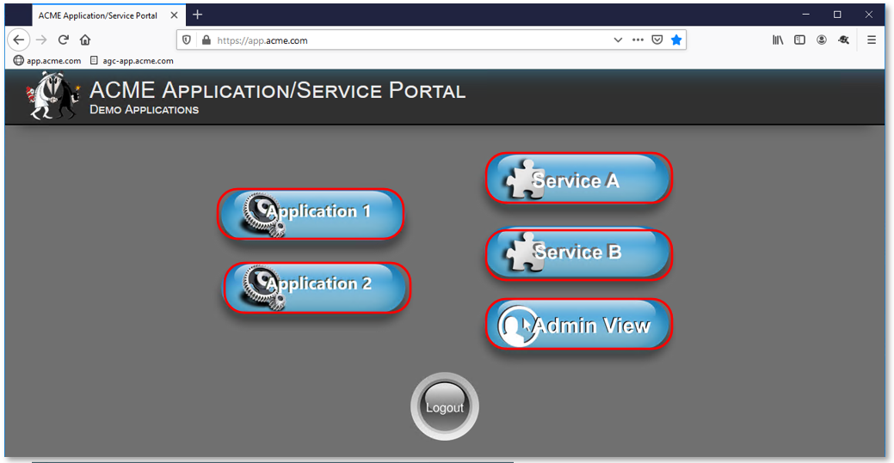
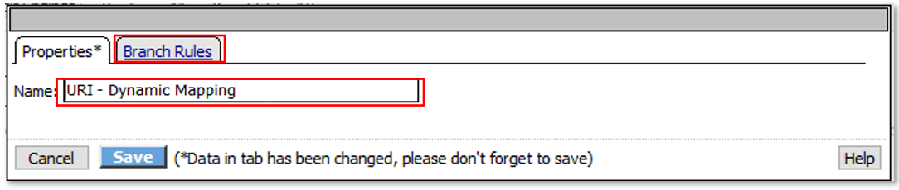
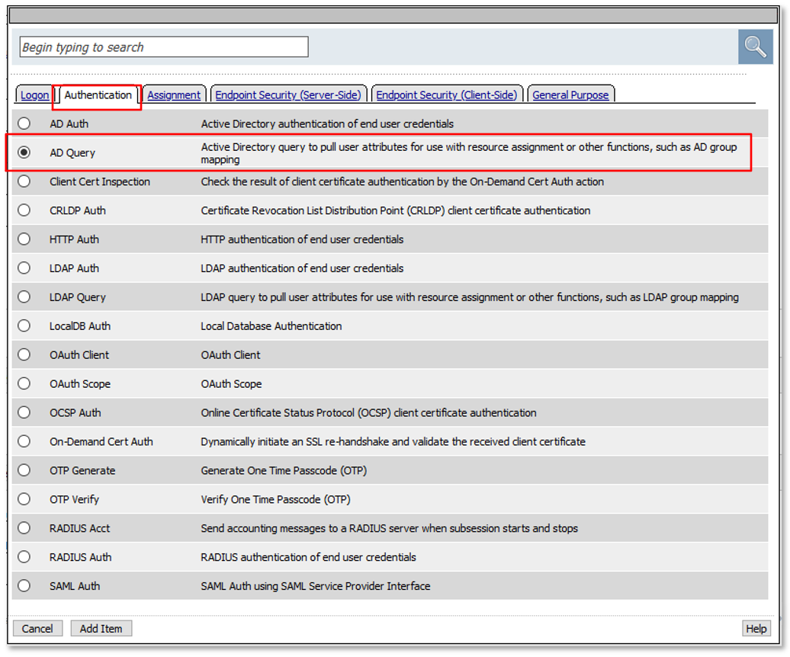
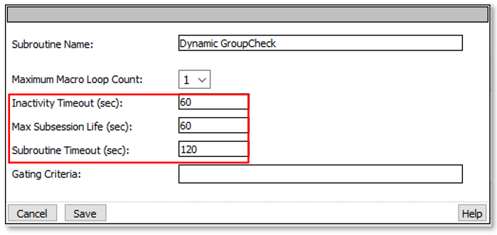
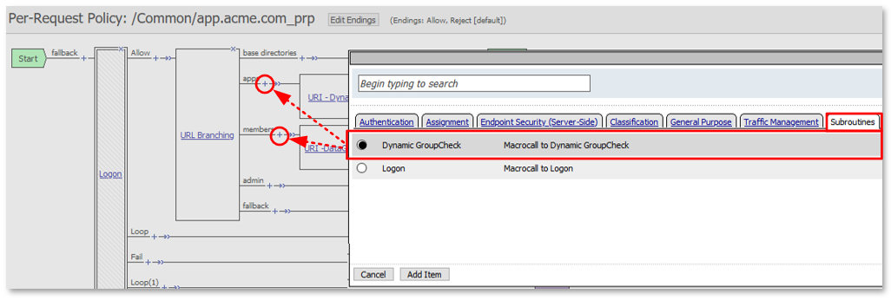

Lab 2: Custom Per Request Policy
================================

The purpose of this lab is to build a custom Per Request Policy flow (PRP) and
then extend that policy with additional subroutines to perform dynamic updates 
to access controls and authentication requirements. Per Request Policies will 
restict or grant access based on dynamic queries AD Group Membership and the
URI accessed. Step-up authneitcation will also be leveraged.
Students will configure the various aspects using the Visual Policy Editor, 
review the configuration and perform tests of the deployment.

Objective:
----------

-  Gain a deeper understanding of Per Request Policies and their applicability
   in various delivery and control scenarios
   
-  Gain a further understanding of Per Request Policy Subroutines and their 
   use in dynamic queries, step authentication and HTTP connector queries.

Lab Requirements:
-----------------

-  All Lab requirements will be noted in the tasks that follow

-  Estimated completion time: 30 minutes

Lab 2 Tasks:
-----------------

TASK 1: Prepare Lab Environment
~~~~~~~~~~~~~~~~~~~~~~~~~~~~~~~

+----------------------------------------------------------------------------------------------+
| 1. From the Jumphost desktop, click on the **Remove-User1-from-App2** PowerShell Script.     |
|                                                                                              |
|    This prepares the environment for further user testing.                                   |
+----------------------------------------------------------------------------------------------+
| |image001|                                                                                   |
+----------------------------------------------------------------------------------------------+

TASK 2: Review Existing Configuration
~~~~~~~~~~~~~~~~~~~~~~~~~~~~~~~~~~~~~

+----------------------------------------------------------------------------------------------+
| 1. On **bigip1.f5lab.local**, navigate to **Local Traffic -> Virtual Servers -> Virtual**    |
|                                                                                              |
|    ** Server Lists**.                                                                        |
|                                                                                              |
| 2. Click on the link for the **app.acme.com_vs**.                                            |
+----------------------------------------------------------------------------------------------+
| |image002|                                                                                   |
+----------------------------------------------------------------------------------------------+

+----------------------------------------------------------------------------------------------+
| 3. Within the **app.acme.com_vs** configuration, scroll down to the **Access Policy**        |
|                                                                                              |
|    section, note the Per Session and Per Request policies applied.                           |
+----------------------------------------------------------------------------------------------+
| |image003|                                                                                   |
+----------------------------------------------------------------------------------------------+

+----------------------------------------------------------------------------------------------+
| 4. Navigate to **Access -> Profiles/Policies -> Access Profiles (Per-Session Policies) and   |
|                                                                                              |
|    then click the **Edit** link for the **app.acme.com_psp** Per Session Policy.             |
+----------------------------------------------------------------------------------------------+
| |image004|                                                                                   |
+----------------------------------------------------------------------------------------------+

+----------------------------------------------------------------------------------------------+
| 5. Note that the **app.acme.com_psp** Access Policy simply has **Start -> Allow**.  All      |
|                                                                                              |
|    Access configurations will occur in the Per Reuqest Policy.                               |
+----------------------------------------------------------------------------------------------+
| |image005|                                                                                   |
+----------------------------------------------------------------------------------------------+

+----------------------------------------------------------------------------------------------+
| 5. Navigate to **Access -> Profiles/Policies -> Per-Request Policies and then click the      |
|                                                                                              |
|    **Edit** link for the **app.acme.com_prp** Per Request Policy.                            |
+----------------------------------------------------------------------------------------------+
| |image006|                                                                                   |
+----------------------------------------------------------------------------------------------+

+----------------------------------------------------------------------------------------------+
| 6. Review the **app.acme.com_prp** Per Request Policy and the Subroutine.                    |
|                                                                                              |
| 7. Click on the **+ (Plus Symbol)** to expand the **Logon** Subroutine.  Then click on the   |
|                                                                                              |
|    **Subroutine Settings / Rename** link.                                                    |
+----------------------------------------------------------------------------------------------+
| |image007|                                                                                   |
+----------------------------------------------------------------------------------------------+

+----------------------------------------------------------------------------------------------+
| 8. Review the **Logon** Subroutine settings.  These settings will determine inactivity       |
|                                                                                              |
|    timers and session lifetime.                                                              |
+----------------------------------------------------------------------------------------------+
| |image008|                                                                                   |
+----------------------------------------------------------------------------------------------+

+----------------------------------------------------------------------------------------------+
| 9. Open **Firefox**, click on the **app.acme.com** link provided in the Bookmark toolbar.    |
|                                                                                              |
| 10. Note that currently, the logged in user, user1, has access to all applications even      |
|                                                                                              |
|     though the user does no currently have the necessary group access for all applications.  |
+----------------------------------------------------------------------------------------------+
| |image009|                                                                                   |
|                                                                                              |
| |image010|                                                                                   |
+----------------------------------------------------------------------------------------------+

TASK 3: URI Dynamic & DataGroup Filtering (via AD Group Membership)
~~~~~~~~~~~~~~~~~~~~~~~~~~~~~~~~~~~~~~~~~~~~~~~~~~~~~~~~~~~~~~~~~~~

+----------------------------------------------------------------------------------------------+
| 1. Navigate to **Access -> Profiles/Policies -> Per-Request Policies and then click the      |
|                                                                                              |
|    **Edit** link for the **app.acme.com_prp** Per Request Policy.                            |    
|                                                                                              |
| 2. In the resulting Visual Policy Editor window, click on the **+ (Plus Symbol)** on the     |
|                                                                                              |
|    **apps** branch following **URL Branching**.                                              |
|                                                                                              |
| 3. In the pop-up window, select the **General Purpose** tab, then click the radio button     |
|                                                                                              |
|    on the **Empty** action line, then click **Add Item**.                                    |
+----------------------------------------------------------------------------------------------+
| |image011|                                                                                   |
+----------------------------------------------------------------------------------------------+

+----------------------------------------------------------------------------------------------+
| 4. Enter **URI - Dynamic Mapping** in the **Name** field.                                    |
+----------------------------------------------------------------------------------------------+
| |image012|                                                                                   |
+----------------------------------------------------------------------------------------------+

+----------------------------------------------------------------------------------------------+
| 5. In the next window, click the **Add Branch Rule**.                                        |
|                                                                                              |
| 6. In the new section, enter **App Access** in the **Name** field.                           |
|                                                                                              |
| 7. Click the **change** link.                                                                |
+----------------------------------------------------------------------------------------------+
| |image013|                                                                                   |
+----------------------------------------------------------------------------------------------+

+----------------------------------------------------------------------------------------------+
| 8. In the resulting window, click on the **Advanced** tab.                                   |
|                                                                                              |
| 9. Paste the text below into the provided window and then click **Finished**.                |
+----------------------------------------------------------------------------------------------+
| |image014|                                                                                   |
+----------------------------------------------------------------------------------------------+

'''expr {[mcget {subsession.ad.last.attr.memberOf}] contains "CN=[findstr [mcget {perflow.category_lookup.result.url}] "http" 26 "/"],OU=Groups,DC=f5lab,DC=local"}'''

+----------------------------------------------------------------------------------------------+
| 10. Click **Save** in the resulting window.                                                  |
+----------------------------------------------------------------------------------------------+
| |image015|                                                                                   |
+----------------------------------------------------------------------------------------------+

+----------------------------------------------------------------------------------------------+
| 11. Review the added **URI - Dynamic Mapping** agent.  Ensure the **Allow** and **Reject**   |
|                                                                                              |
|     endings are set as shown.                                                                |
+----------------------------------------------------------------------------------------------+
| |image016|                                                                                   |
+----------------------------------------------------------------------------------------------+

+----------------------------------------------------------------------------------------------+
| 13. In the Visual Policy Editor window, click on the **+ (Plus Symbol)** on the **members**  |
|                                                                                              |
|     branch following **URL Branching**.                                                      |
|                                                                                              |
| 14. In the pop-up window, select the **General Purpose** tab, then click the radio button    |
|                                                                                              |
|    on the **Empty** action line, then click **Add Item**.                                    |
+----------------------------------------------------------------------------------------------+
| |image017|                                                                                   |
+----------------------------------------------------------------------------------------------+

+----------------------------------------------------------------------------------------------+
| 15. Enter **URI - DataGroup Mapping** in the **Name** field.                                 |
+----------------------------------------------------------------------------------------------+
| |image018|                                                                                   |
+----------------------------------------------------------------------------------------------+

+----------------------------------------------------------------------------------------------+
| 16. In the next window, click the **Add Branch Rule**.                                       |
|                                                                                              |
| 17. In the new section, enter **Member Access** in the **Name** field.                       |
|                                                                                              |
| 18. Click the **change** link.                                                               |
+----------------------------------------------------------------------------------------------+
| |image019|                                                                                   |
+----------------------------------------------------------------------------------------------+

+----------------------------------------------------------------------------------------------+
| 19. In the resulting window, click on the **Advanced** tab.                                  |
|                                                                                              |
| 20. Paste the text below into the provided window and then click **Finished**.               |
+----------------------------------------------------------------------------------------------+
| |image020|                                                                                   |
+----------------------------------------------------------------------------------------------+

'''expr {[mcget {subsession.ad.last.attr.memberOf}] contains "[class match -value [findstr [mcget {perflow.category_lookup.result.url}] "http" 28 "/"] eq acme_app.acme.com_dg]"}'''

+----------------------------------------------------------------------------------------------+
| 21. Click **Save** in the resulting window.                                                  |
+----------------------------------------------------------------------------------------------+
| |image021|                                                                                   |
+----------------------------------------------------------------------------------------------+

+----------------------------------------------------------------------------------------------+
| 22. Review the added **URI - DataGroup Mapping** agent.  Ensure the **Allow** and **Reject** |
|                                                                                              |
|     endings are set as shown.                                                                |
+----------------------------------------------------------------------------------------------+
| |image022|                                                                                   |
+----------------------------------------------------------------------------------------------+

TASK 4: Testing URI Dynamic & DataGroup Filtering
~~~~~~~~~~~~~~~~~~~~~~~~~~~~~~~~~~~~~~~~~~~~~~~~~

+----------------------------------------------------------------------------------------------+
| 1. Return to **Firefox** test access to all the applications again.                          |
|                                                                                              |
| 2. Access to **App1**, **Member Services A** and the **Admin** application is still granted  |
|                                                                                              |
|    based on current AD Group Membership for user1.                                           |
+----------------------------------------------------------------------------------------------+
| |image023|                                                                                   |
|                                                                                              |
| |image024|                                                                                   |
+----------------------------------------------------------------------------------------------+

+----------------------------------------------------------------------------------------------+
| 3. Access to **App2** and **Member Services B** are denied based on current AD Group         |
|                                                                                              |
|    Membership for user1.                                                                     |
+----------------------------------------------------------------------------------------------+
| |image025|                                                                                   |
+----------------------------------------------------------------------------------------------+

TASK 5: Adding a new Application (App3)
~~~~~~~~~~~~~~~~~~~~~~~~~~~~~~~~~~~~~~~

+----------------------------------------------------------------------------------------------+
| 1. Deploy **App3** by clicking on the **Deploy App3* PowerShell link provided on the         |
|                                                                                              |
|    jumphost desktop.                                                                         |
+----------------------------------------------------------------------------------------------+
| |image026|                                                                                   |
+----------------------------------------------------------------------------------------------+

+----------------------------------------------------------------------------------------------+
| 2. Return to **Firefox** to see the newly deployed **App3** and test access to it.           |
|                                                                                              |
| 3. Even though **App3** is newly deployed, user1 access is still blocked based on AD Group   |
|                                                                                              |
|    membership.                                                                               |
|                                                                                              |
| 4. Note that no policy changes were required due to the dynamic URI mapping configured.      |
+----------------------------------------------------------------------------------------------+
| |image027|                                                                                   |
|                                                                                              |
| |image028|                                                                                   |
+----------------------------------------------------------------------------------------------+

TASK 6: Dynamic Group Checks
~~~~~~~~~~~~~~~~~~~~~~~~~~~~

+----------------------------------------------------------------------------------------------+
| 1. Navigate to **Access -> Profiles/Policies -> Per-Request Policies and then click the      |
|                                                                                              |
|    **Edit** link for the **app.acme.com_prp** Per Request Policy (or use the already open    |
|                                                                                              |
|    browser tab).                                                                             |
|                                                                                              |
| 2. In the resulting Visual Policy Editor window, click on the **Add New Subroutine** on the  |
|                                                                                              |
|    **apps** branch following **URL Branching**.                                              |
+----------------------------------------------------------------------------------------------+
| |image029|                                                                                   |
+----------------------------------------------------------------------------------------------+

+----------------------------------------------------------------------------------------------+
| 3. Enter **Dynamic GroupCheck** in the **Name** field and then click **Save**.               |
+----------------------------------------------------------------------------------------------+
| |image030|                                                                                   |
+----------------------------------------------------------------------------------------------+

+----------------------------------------------------------------------------------------------+
| 4. Click on the **+ (Plus Symbol)** to expand the **Dynamic GroupCheck** Subroutine.  Then   |
|                                                                                              |
|    click on the **+ (Plus Symbol)** between the **In** and **Out** tags.                     |
+----------------------------------------------------------------------------------------------+
| |image031|                                                                                   |
+----------------------------------------------------------------------------------------------+

+----------------------------------------------------------------------------------------------+
| 5. In the resulting window, click the **Authentication** tab, then select the radio button   |
|                                                                                              |
|     on the **AD Query** row, then click **Add Item**.                                        |
+----------------------------------------------------------------------------------------------+
| |image032|                                                                                   |
+----------------------------------------------------------------------------------------------+

+----------------------------------------------------------------------------------------------+
| 6. In the resulting **AD Query** window, select **/Common/f5lab.local** from the **Server**  |
|                                                                                              |
|    dropdown.                                                                                 |
|                                                                                              |
| 7. Enter the following **sAMAccountName=%{subsession.logon.last.username}** in the           |
|                                                                                              |
|    **SearchFilter** field.                                                                   |
|                                                                                              |
| 8. Under the **Required Attributes** section click the **X** icon for all attributes except  |
|                                                                                              |
|    **memberOf** (row 9).                                                                     |
+----------------------------------------------------------------------------------------------+
| |image033|                                                                                   |
|                                                                                              |
| |image034|                                                                                   |
+----------------------------------------------------------------------------------------------+

+----------------------------------------------------------------------------------------------+
| 9. In the **Dynamic GroupCheck** Subroutine, click the **Subroutine Settings / Rename** link |
+----------------------------------------------------------------------------------------------+
| |image035|                                                                                   |
+----------------------------------------------------------------------------------------------+

+----------------------------------------------------------------------------------------------+
| 10. In the **Dynamic GroupCheck** Subroutine Settings change the following values:           |
|                                                                                              |
| - **Inactivity Timeout (sec): 60**                                                           |
|                                                                                              |
| - **Max Subsession Life (sec): 60**                                                          |
|                                                                                              |
| - **Subroutine Timeout (sec): 120**                                                          |
|                                                                                              |
| 11. Click the **Save** button.                                                               |
+----------------------------------------------------------------------------------------------+
| |image036|                                                                                   |
+----------------------------------------------------------------------------------------------+

+----------------------------------------------------------------------------------------------+
| 12. In the main section of the **app.acme.com_prp** policy click the **+ (Plus Symbol)** in  |
|                                                                                              |
|     both the **apps** and **member** branches.                                               |
|                                                                                              |
| 13. In the resulting pop-up window, click the **Subroutines** tab, the click the radio       |
|                                                                                              |
|     button on the **Dynamic GroupCheck** and then click the **Add Item** button. Do this     |
|                                                                                              |
|     for both branches.                                                                       |
+----------------------------------------------------------------------------------------------+
| |image037|                                                                                   |
+----------------------------------------------------------------------------------------------+

+----------------------------------------------------------------------------------------------+
| 14. Review the policy changes to confirm subroutines have been added correctly.              |
+----------------------------------------------------------------------------------------------+
| |image038|                                                                                   |
+----------------------------------------------------------------------------------------------+

TASK 7: Dynamic Group Checks Testing
~~~~~~~~~~~~~~~~~~~~~~~~~~~~~~~~~~~~

+----------------------------------------------------------------------------------------------+
| 1. Add **user1** to the **app2** and **app3** AD Groups by clicking on the                   |
|                                                                                              |
|    **Add-User1-to-App2** and **Add-User1-to-App3** PowerShell scripts on the jumphost        |
|                                                                                              |
|    desktop.                                                                                  |
+----------------------------------------------------------------------------------------------+
| |image039|                                                                                   |
+----------------------------------------------------------------------------------------------+

+----------------------------------------------------------------------------------------------+
| 2. Return to **Firefox** test access to applications **app1**, **app2** and **app3**.        |
|                                                                                              |
|    Note 60 seconds should elapse (the subsession timeout) before testing access to the       |
|                                                                                              |
|    applications begin.                                                                       |
+----------------------------------------------------------------------------------------------+
| |image040|                                                                                   |
+----------------------------------------------------------------------------------------------+

+----------------------------------------------------------------------------------------------+
| 3. Return to Jumphost desktop and run the **Remove-User1-from-App2**.                        |
|                                                                                              |
| 4. Return to **Firefox** test access to application **app2**. Note 60 seconds should elapse  |
|                                                                                              |
|    (the subsession timeout) before testing to the application begins.                        |
+----------------------------------------------------------------------------------------------+
| |image041|                                                                                   |
+----------------------------------------------------------------------------------------------+

TASK 8: Dynamic Group Checks Testing
~~~~~~~~~~~~~~~~~~~~~~~~~~~~~~~~~~~~

.. |image001| image:: media/lab2-001.png
   :width: 4.5in
   :height: 2.32in
.. |image002| image:: media/lab2-002.png
   :width: 4.5in
   :height: 2.32in
.. |image003| image:: media/lab2-003.png
   :width: 4.5in
   :height: 2.32in
.. |image004| image:: media/lab2-004.png
   :width: 4.5in
   :height: 2.32in
.. |image005| image:: media/lab2-005.png
   :width: 4.5in
   :height: 2.32in
.. |image006| image:: media/lab2-006.png
   :width: 4.5in
   :height: 2.32in
.. |image007| image:: media/lab2-007.png
   :width: 4.5in
   :height: 2.32in
.. |image008| image:: media/lab2-008.png
   :width: 4.5in
   :height: 2.32in

.. |image010| image:: media/lab2-010.png
   :width: 4.5in
   :height: 2.32in
.. |image011| image:: media/lab2-011.png
   :width: 4.5in
   :height: 2.32in
.. |image012| image:: media/lab2-012.png
   :width: 4.5in
   :height: 2.32in
.. |image013| image:: media/lab2-013.png
   :width: 4.5in
   :height: 2.32in
.. |image014| image:: media/lab2-014.png
   :width: 4.5in
   :height: 2.32in
.. |image015| image:: media/lab2-015.png
   :width: 4.5in
   :height: 2.32in
.. |image016| image:: media/lab2-016.png
   :width: 4.5in
   :height: 2.32in
.. |image017| image:: media/lab2-017.png
   :width: 4.5in
   :height: 2.32in

.. |image019| image:: media/lab2-019.png
   :width: 4.5in
   :height: 2.32in
.. |image020| image:: media/lab2-020.png
   :width: 4.5in
   :height: 2.32in
.. |image021| image:: media/lab2-021.png
   :width: 4.5in
   :height: 2.32in
.. |image022| image:: media/lab2-022.png
   :width: 4.5in
   :height: 2.32in
.. |image023| image:: media/lab2-023.png
   :width: 4.5in
   :height: 2.32in
.. |image024| image:: media/lab2-024.png
   :width: 4.5in
   :height: 2.32in
.. |image025| image:: media/lab2-025.png
   :width: 4.5in
   :height: 2.32in
.. |image026| image:: media/lab2-026.png
   :width: 4.5in
   :height: 2.32in
.. |image027| image:: media/lab2-027.png
   :width: 4.5in
   :height: 2.32in
.. |image028| image:: media/lab2-028.png
   :width: 4.5in
   :height: 2.32in
.. |image029| image:: media/lab2-029.png
   :width: 4.5in
   :height: 2.32in
.. |image030| image:: media/lab2-030.png
   :width: 4.5in
   :height: 2.32in
.. |image031| image:: media/lab2-031.png
   :width: 4.5in
   :height: 2.32in

.. |image033| image:: media/lab2-033.png
   :width: 4.5in
   :height: 2.32in
.. |image034| image:: media/lab2-034.png
   :width: 4.5in
   :height: 2.32in
.. |image035| image:: media/lab2-035.png
   :width: 4.5in
   :height: 2.32in

.. |image038| image:: media/lab2-038.png
   :width: 4.5in
   :height: 2.32in

.. |image040| image:: media/lab2-040.png
   :width: 4.5in
   :height: 2.32in
.. |image041| image:: media/lab2-041.png
   :width: 4.5in
   :height: 2.32in
.. |image042| image:: media/lab2-042.png
   :width: 4.5in
   :height: 2.32in
